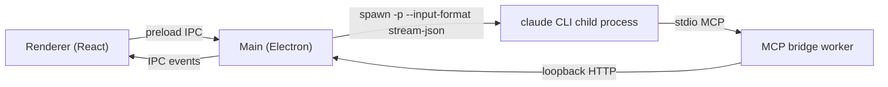

# Engram Desktop

A native macOS learning environment that drives the engram learning plugin for Claude Code's spaced-repetition loop by scripting the `claude` CLI headlessly. The app never calls a model API directly — every teaching turn, grade, and coaching insight comes from a `claude -p` child process running the installed `/engram:learn`, `/engram:review`, and `/engram:coach` skills.

## Screenshots

| Home | Learn session |
|---|---|
|  |  |

| Topic atlas | Review |
|---|---|
|  |  |

*Screenshots pending.*

## Features

- **`/learn`** — dialogue-grammar teaching sessions (open a gap, predict/attempt, struggle, resolve, self-explain, connect) with a live beat stepper tracking progress through each node, a free-recall composer for graded attempts, and grade receipts inline in the transcript.
- **`/review`** — spaced-repetition audits: the app surfaces due items, the learner free-recalls before any answer is shown, and honest grading runs against reveal cards rather than the learner's own self-assessment.
- **`/coach`** — a dashboard view for retention stats, calibration, and standing learning strategy.
- **Topic atlas** — a 2D ink-plate map of a topic's nodes, spotlighted live during CONNECT beats and browsable on its own.
- **Session tickets and calibration** — each session closes out with a receipt of what was taught, graded, and scheduled next.
- **Night Atlas design language** — a sepia-ink-on-night visual system (warm ink for consolidated signal, cool ink for not-yet-consolidated) shared across every view.
- **Native macOS shell** — frameless title bar, a real application menu, and keyboard shortcuts: ⌘N (new topic), ⌘L (resume last learn session), ⇧⌘R (review now).

## Architecture at a glance



- **Renderer → preload IPC**: the React UI sends user messages and receives session events only through the preload bridge, never touching Node or the filesystem directly.
- **Main → claude CLI**: `SessionManager` spawns `claude -p` with `--input-format/--output-format stream-json`, a scoped `--tools`/`--allowedTools`/`--disallowedTools` set, `--permission-mode bypassPermissions`, and an `--append-system-prompt` that documents the bridge tools — one child process per live session.
- **claude CLI → MCP bridge worker**: the CLI's `--mcp-config` points at a small stdio MCP server (`mcpBridgeWorker.mjs`) that stands in for the native `AskUserQuestion` tool and exposes seven more advisory UI tools, since headless `-p` mode has no native way to prompt a human.
- **Bridge worker → loopback HTTP → Main**: the worker relays each MCP call over plain HTTP to a loopback server in the main process, which is what actually holds a request open until a human answers.
- **Main → Renderer (IPC events)**: the main process turns both the CLI's stdout NDJSON stream and the bridge's relayed calls into typed IPC events the UI renders as beats, receipts, prompts, and map spotlights.

## Quick start

Prerequisites:
- Node.js 22 or later
- The `claude` CLI installed and authenticated
- The engram learning plugin for Claude Code installed

```bash
cd app
npm install
npm run dev
```

## Tech stack

- Electron 36, React 19, TypeScript
- electron-vite (build/dev tooling), Tailwind CSS 4
- KaTeX (math rendering), marked (markdown rendering)
- zod (MCP bridge tool schemas), esbuild (bridge worker bundle for packaged builds)
- `@modelcontextprotocol/sdk` (the bridge worker's stdio MCP server)

## Documentation

- [Architecture](docs/architecture.md) — how sessions, the bridge, and IPC fit together in more depth
- [Learning loop](docs/learning-loop.md) — how `/learn`, `/review`, and `/coach` map onto the dialogue grammar and FSRS scheduling
- [Design language](docs/design-language.md) — the Night Atlas visual system
- [Development](docs/development.md) — building, packaging, and working on the app
- [Design history](docs/design-history/README.md) — specs and plans behind the app's evolution
