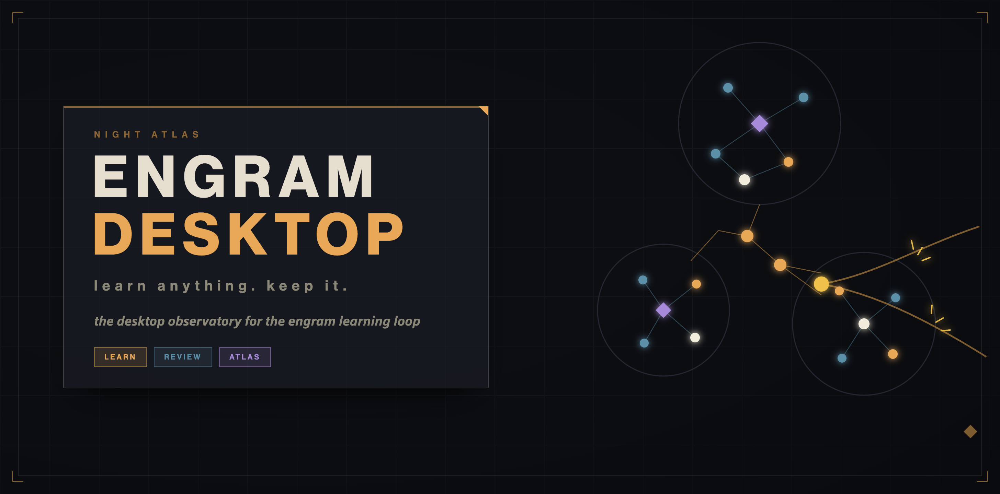
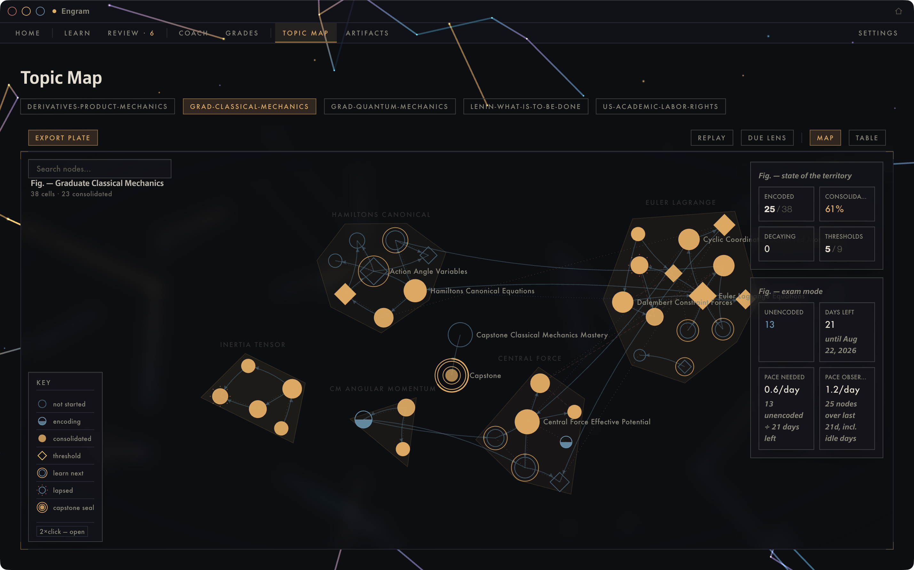
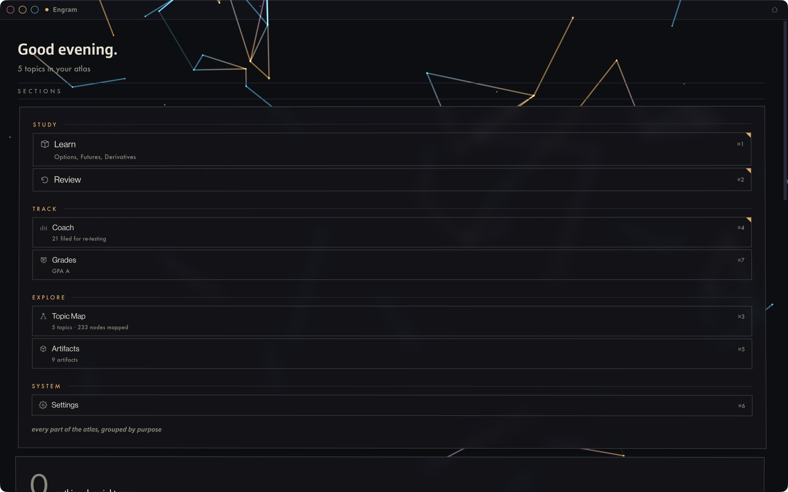
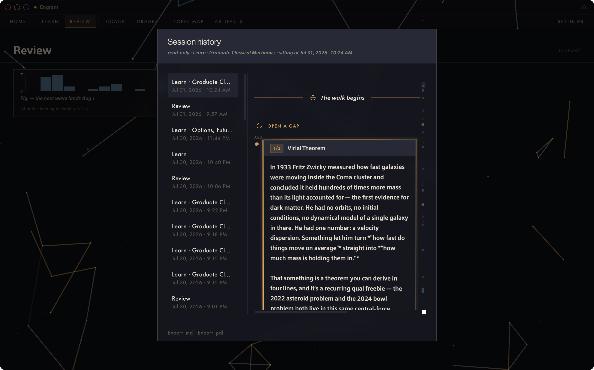
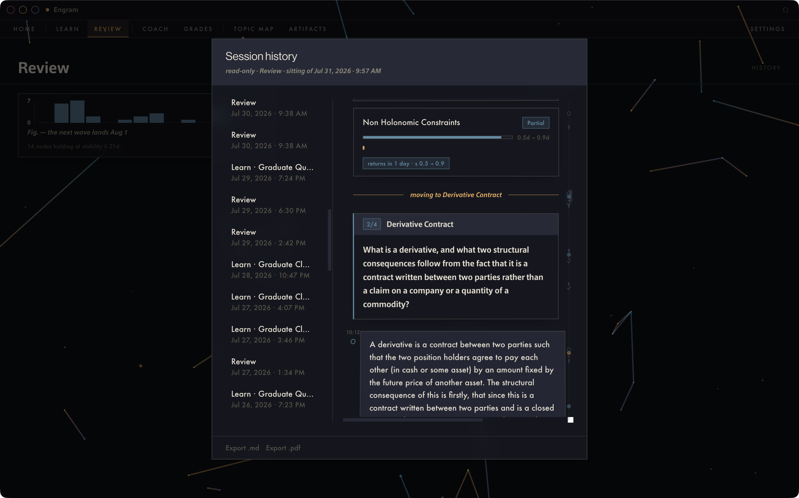
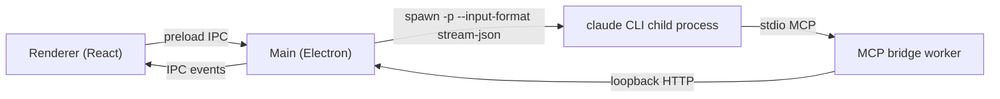

# Engram Desktop

[](https://github.com/nullgeodesic0/engram-desktop/stargazers)
[](https://github.com/nagisanzenin/engram)


**A native macOS home for the [engram](https://github.com/nagisanzenin/engram) learning loop — the tutor that makes you do the thinking, in an app built for the sitting.**

Engram Desktop drives the engram learning plugin's spaced-repetition loop by scripting the Claude Code CLI headlessly. Every teaching turn, blind grade, and schedule update comes from a `claude -p` child process running the installed `/engram:learn`, `/engram:review`, and `/engram:coach` skills — the app never calls a model API directly, and all learning state stays in engram's own local files. What the app adds is the environment: a transcript that understands the dialogue's structure, a living map of what you know, and a shell that treats a study session as something worth sitting down for.



## What is this?

The mix-up worth clearing first: Engram Desktop is a **desktop client**, not a learning engine. The engine is [engram by nagisanzenin](https://github.com/nagisanzenin/engram) — an evidence-based learning system for Claude Code that decomposes topics into concept graphs, teaches through forced retrieval, grades free recall blind, and schedules each concept's return with FSRS just before you'd lose it. All of that ships in the plugin and its `engram.py`, unmodified.

This app is what the loop looks like when it isn't happening in a terminal:

| It is | It is not |
|---|---|
| A native shell around the engram plugin's three commands | A fork of engram — the plugin and its state files are untouched |
| A structured reading of the tutoring dialogue (beats, receipts, tickets) | A different pedagogy — the dialogue grammar is the plugin's own |
| A scriptable host for the `claude` CLI, one child process per session | An API client — no Anthropic API key, no direct model calls |
| 100% local — state in `~/.claude/learning/`, UI state in Electron's app data | A sync service, tracker, or anything with a server |

## Screenshots

| Home — the atlas hub, grouped by purpose | A `/learn` walk — beats, probe cards, KaTeX |
|---|---|
|  |  |

| `/review` — free recall, blind receipts, stability movement |
|---|
|  |

## The loop, in this app

Engram's core discipline is *generation before explanation*: the tutor opens a question, you predict, you struggle a little (hints, not answers), it resolves, you explain it back. The desktop app renders that grammar instead of flattening it into chat:

- **The beat stepper** tracks each node's walk through `open_gap → predict → struggle → resolve → self_explain → connect`, driven live by the session itself (the tutor signals beats over an MCP bridge; the UI listens, never steers).
- **Free recall is composer-first.** In `/review`, the due item's prompt is shown and the answer field is just a field — nothing to reveal, nothing to rate yourself on. A separate assessor grades what you wrote, blind to the tutoring dialogue, and the receipt lands in the transcript as a card: grade, stability movement, next due date.
- **Honest grading stays honest.** Grades come from the plugin's separation-of-powers pipeline (tutor and assessor are different agents with different context); the app displays receipts, it does not negotiate them.
- **The topic atlas** draws each topic as an ink-plate map — warm ink for consolidated concepts, cool for not-yet, dashed halos for threshold concepts — and the tutor can spotlight nodes on it mid-dialogue when a CONNECT beat lands.
- **Session bookends**: a walk opens with the story so far (last sitting's grades, anything shaky) and closes with a signed ceremony — tally, stability movements, earliest return date, and your own return commitment.

Everything advisory degrades gracefully: if a session never signals a beat or a spotlight, the transcript still reads as clean prose. The loop's philosophy — free recall before recognition, no auto-send, no pity passes — is enforced by the plugin and honored by the UI. [More in docs/learning-loop.md.](docs/learning-loop.md)

## Feature tour

The app's surfaces group the way its navigation does — study, track, explore — with a persistent glass command strip carrying you between them (hidden on Home, where the hub itself is the navigation).

**Study**

- **Learn and Review as full environments**: session mastheads with live clocks and loop position, a beat stepper, composer-first free recall, KaTeX throughout (including the floating probe card), and session bookends — the story so far on open, a signed summary ceremony on close.
- **Structured session cards over MCP**: the tutor renders its session ticket (`render_ticket`) and the assessor's verdicts (`report_verdict`) as first-class cards — grade chips, stability movement, next due date — instead of prose you have to squint at.
- **Exam mode**: pin a target date to a topic and the coach paces the schedule toward it.

**Track**

- **Grades**: every topic carries a letter grade (A–F) computed from recall, punctuality, coverage, conceptual repair, and calibration — with a GPA across topics, historical trend sparklines, assignment-style session grouping, and event rows that deep-link into the exact moment of the transcript that earned them.
- **Misconception ledger**: misconceptions the tutor files mid-dialogue are pinned into the transcript as specimen labels, tracked in a ledger, surfaced as a digest when a review session opens, and cleared two ways — earned (demonstrate the correction and the tutor resolves it) or manual, with provenance shown either way. A per-row **Re-test** launcher spins up a targeted probe on demand.
- **Session history**: a global, searchable record of every sitting, hydrated from transcripts on disk.

**Explore**

- **The topic atlas**: cluster-first layout that keeps subtopic regions geometrically disjoint (no overlapping discs, no crossed spines, even on 100+-node maps), a focus lens for reading dense neighborhoods, tutor spotlights mid-dialogue, and one-click export of the whole map as a PDF.
- **Interactive charts**: retention, momentum, and stability surfaces with developed axes and hover instruments — all local SVG, no charting library.

**Shell**

- **Night Atlas design language**: sharp-cornered glass panels over a void ground, warm/cool ink telling consolidated from not-yet, subtle 3D tilt physics on cards, and a full light theme — documented in [docs/design-tokens.md](docs/design-tokens.md) as a portable reference. Type renders on bundled open faces (Space Grotesk, Fraunces, Inter); if you own licenses for the app's first-choice commercial faces, [drop them in](app/src/renderer/src/assets/fonts/README.md) and they take over.
- **Hardening**: crash logging, a CLI watchdog for the `claude` child process, a doctrine checker that gates every commit against the philosophy constraints, and a vitest suite over the grading math.

## Architecture at a glance



- **Renderer → preload IPC**: the React UI sends user messages and receives session events only through the preload bridge, never touching Node or the filesystem directly.
- **Main → claude CLI**: `SessionManager` spawns `claude -p` with `--input-format/--output-format stream-json`, a scoped `--tools`/`--allowedTools`/`--disallowedTools` set, `--permission-mode bypassPermissions`, and an `--append-system-prompt` that documents the bridge tools — one child process per live session.
- **claude CLI → MCP bridge worker**: the CLI's `--mcp-config` points at a small stdio MCP server (`mcpBridgeWorker.mjs`) that stands in for the native `AskUserQuestion` tool and exposes seven more advisory UI tools, since headless `-p` mode has no native way to prompt a human.
- **Bridge worker → loopback HTTP → Main**: the worker relays each MCP call over plain HTTP to a loopback server in the main process, which is what actually holds a request open until a human answers.
- **Main → Renderer (IPC events)**: the main process turns both the CLI's stdout NDJSON stream and the bridge's relayed calls into typed IPC events the UI renders as beats, receipts, prompts, and map spotlights.

The full story — session lifecycle, the eight bridge tools, transcript hydration, where every file lives — is in [docs/architecture.md](docs/architecture.md).

## Installation

### Prerequisites

1. **macOS on Apple silicon.** The packaged build targets `arm64`; Intel Macs can run from source but are untested.
2. **Node.js 22 or later** (the app is developed on Node 26). Check with `node --version`.
3. **The Claude Code CLI, installed and authenticated.** The app spawns `claude` from your `PATH`; if `claude --version` works in your terminal and you've logged in once, you're set. A Claude subscription or API billing on the CLI is what powers sessions — the app adds no key of its own.
4. **The engram plugin, installed in Claude Code:**

   ```bash
   claude plugin marketplace add nagisanzenin/engram
   ```

   ```bash
   claude plugin install engram@engram
   ```

   Verify with a quick `/engram:coach` in any interactive `claude` session. Engram's state lives at `~/.claude/learning/` — human-readable JSON that this app reads (via `engram.py`) but never rewrites by hand.

### Download a build

Grab the latest DMG from [Releases](https://github.com/nullgeodesic0/engram-desktop/releases) (Apple silicon). The build is unsigned — right-click → Open on first launch, or clear the quarantine flag as described below. Release builds render on the app's bundled open typefaces; the prerequisites above still apply.

### Run from source

```bash
git clone git@github.com:nullgeodesic0/engram-desktop.git
```

```bash
cd engram-desktop/app && npm install && npm run dev
```

`npm run dev` opens the app with hot reload. Useful checks: `npm run typecheck` (both tsconfig projects) and `npm run build` (production compile without packaging).

### Install as an app

```bash
cd engram-desktop/app && npm run dist:mac
```

This bundles the MCP bridge worker with esbuild, builds the renderer, and produces `app/dist/mac-arm64/Engram Desktop.app` (plus a DMG). Then:

```bash
cp -R "app/dist/mac-arm64/Engram Desktop.app" /Applications/
```

The build is unsigned — on first launch, right-click the app → Open, or clear the quarantine flag with `xattr -d com.apple.quarantine "/Applications/Engram Desktop.app"`.

### First run

- **Home** shows your streak, due count, and a continue-learning shelf as soon as engram state exists. If you've never used engram, start with **Learn → Start a new topic**: describe what you want to learn and why, and the plugin's curriculum architect decomposes it into a concept graph while the app draws the atlas being born.
- Quitting the app ends any live session's `claude` process mid-turn; sessions resume from their transcript on disk the next time you open them. Nothing graded is ever lost — receipts are written by `engram.py` the moment they exist.
- If a session fails to start, the in-app message will say why; the usual suspects are `claude` not on `PATH` (launch the app from a shell that has it, or install the CLI system-wide) and the engram plugin missing (`claude plugin install engram@engram`).

## Where your data lives

- **Learning state** (topics, nodes, receipts, FSRS schedules): `~/.claude/learning/`, owned entirely by the engram plugin. Portable — it works in terminal Claude Code and this app interchangeably.
- **App conveniences** (per-topic prompt additions and context files, session history index, window position): `~/Library/Application Support/Engram Desktop/`, plain JSON. Deleting it loses no learning data.
- Nothing leaves your machine except the `claude` CLI's own traffic to Anthropic.

## Tech stack

Electron 36 · React 19 · TypeScript · electron-vite · Tailwind CSS 4 · KaTeX · marked · zod · esbuild · `@modelcontextprotocol/sdk`

## Documentation

- [Architecture](docs/architecture.md) — how sessions, the bridge, and IPC fit together in depth
- [Learning loop](docs/learning-loop.md) — the philosophy constraints, the beat grammar, and how the UI honors both
- [Design language](docs/design-language.md) — Night Atlas: palette, type roles, ink motifs, motion vocabulary
- [Design tokens](docs/design-tokens.md) — the portable token sheet: every color, panel tier, tilt rule, and chip formula
- [Development](docs/development.md) — building, packaging, repo layout, debugging locations
- [Design history](docs/design-history/README.md) — the working specs and plans behind the app's evolution

## Credits

- **[engram](https://github.com/nagisanzenin/engram)** by [nagisanzenin](https://github.com/nagisanzenin) (MIT) — the learning system this app exists to serve: the concept-graph architect, the dialogue grammar, the blind assessor, and the FSRS scheduler are all engram's. If Engram Desktop makes the loop pleasant, engram is what makes it work. *"Learn anything; keep it."*
- Built with [Claude Code](https://claude.com/claude-code); the visual system is described in [docs/design-language.md](docs/design-language.md).

## License

[MIT](LICENSE). The app's first-choice typefaces (Neue Haas Grotesk Display, Epoca Pro) are commercial and are **not** included — the app falls back to bundled open faces without them; see [assets/fonts](app/src/renderer/src/assets/fonts/README.md).
